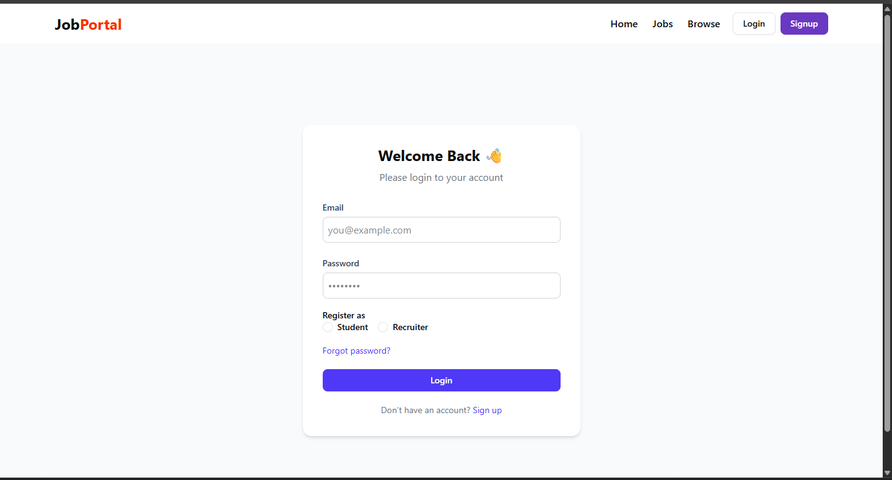
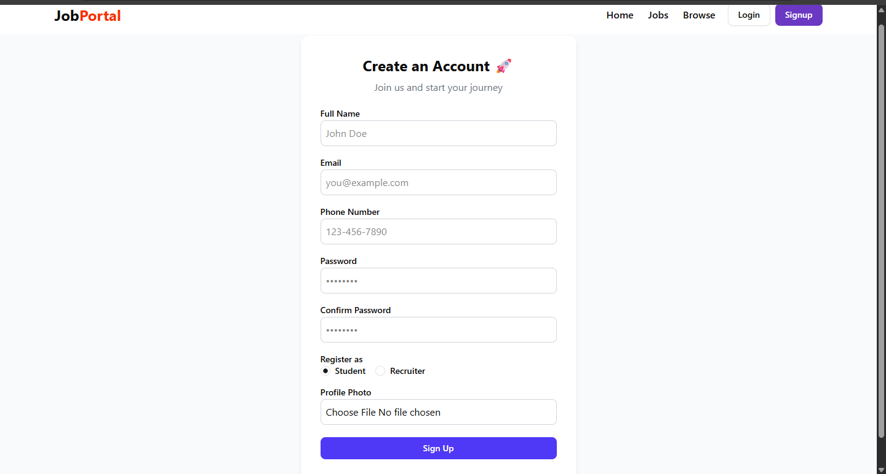
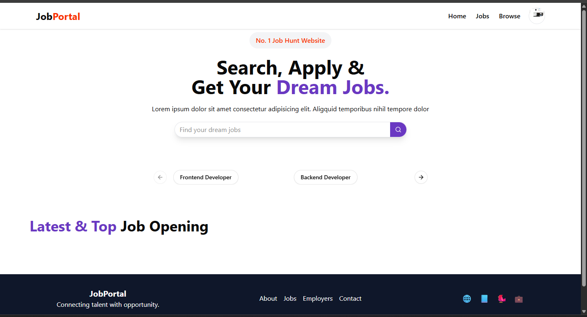
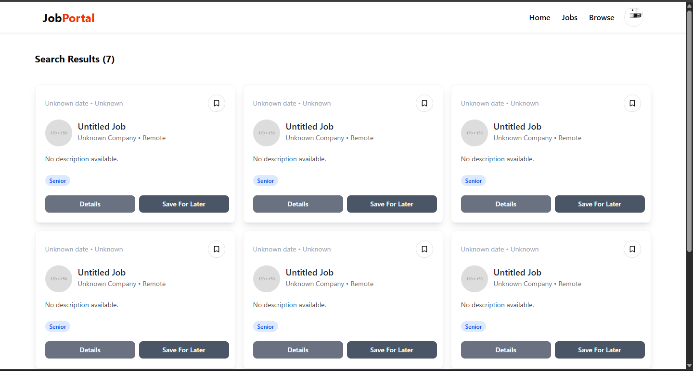
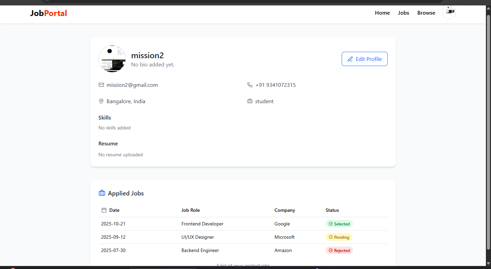
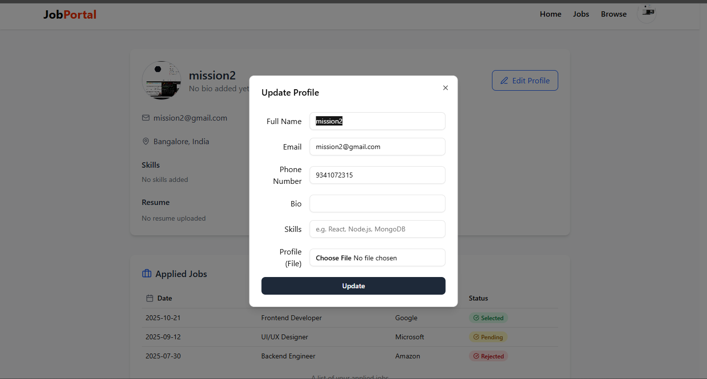
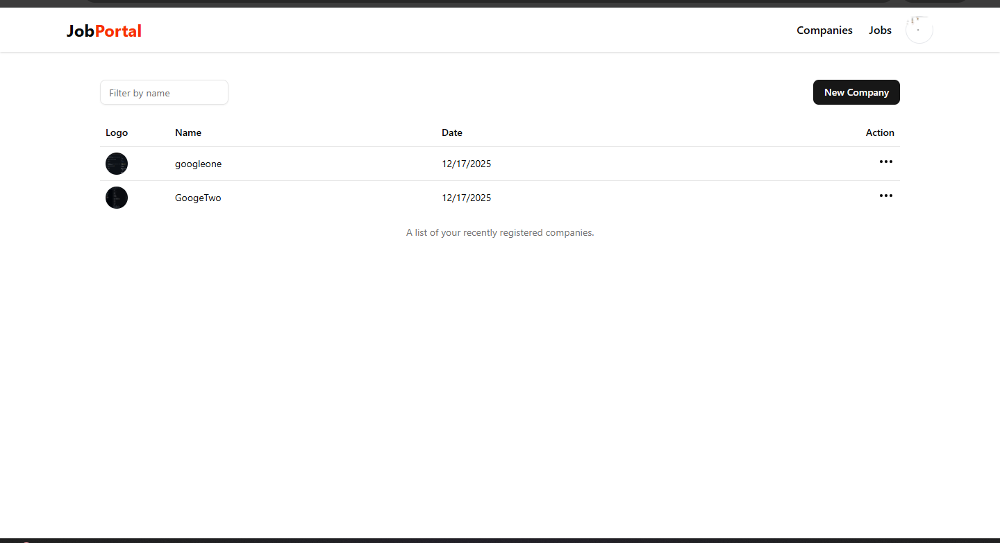
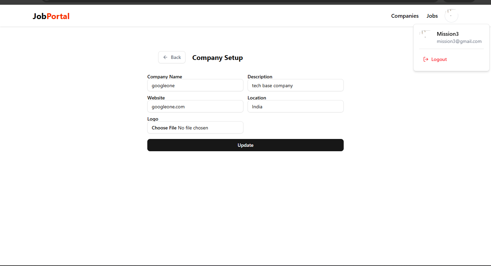
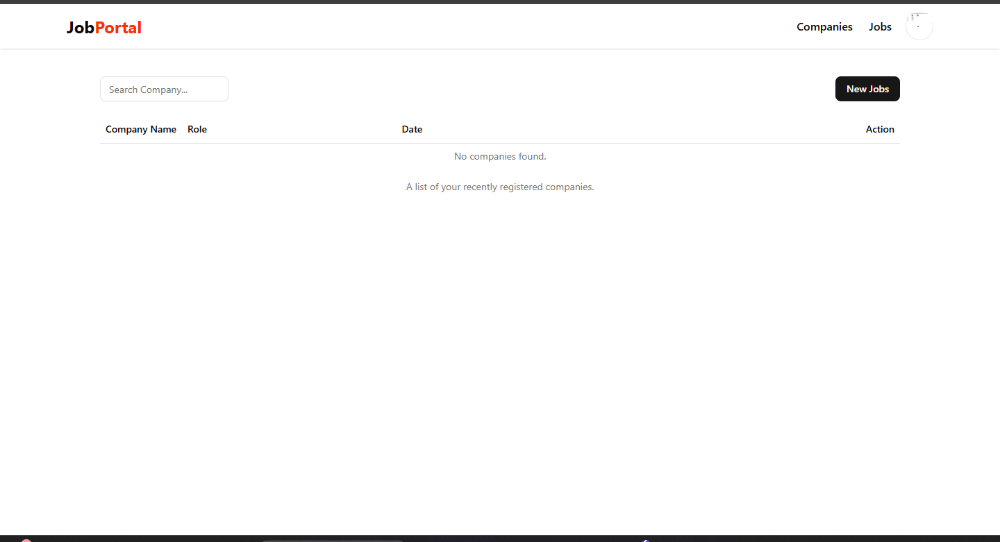

# 📌 Job Portal – MERN Stack

A full‑stack **Job Portal application** built using the **MERN stack**. This platform allows **students to find & apply for jobs** and **recruiters to post jobs, manage companies, and track applications**.

The project focuses on **clean UI**, **role‑based authentication**, **scalable backend**, and **modern React architecture**.

---

## 🚀 Live Demo

🔗 **Frontend:** [https://job-portal-13-11-2025.onrender.com](https://job-portal-13-11-2025.onrender.com)
🔗 **Backend API:** [https://job-portal-13-11-2025.onrender.com/api](https://job-portal-13-11-2025.onrender.com/api)

---

## ✨ Features

### 🔐 Authentication & Authorization

* Student & Recruiter roles
* JWT‑based authentication
* Secure login & signup
* Protected routes

### 👨‍🎓 Student Features

* Browse jobs
* Search & filter jobs
* Apply for jobs
* View applied jobs status
* Profile update (photo, bio, skills)

### 🧑‍💼 Recruiter Features

* Create & manage companies
* Upload company logos
* Post new jobs
* Update job details
* View applicants

### 🏢 Company Management

* Create company
* Update company profile
* Upload logo (Cloudinary)

### 📄 Job Management

* Create jobs
* List jobs
* Job details page
* Apply job functionality

---

## 🖼 Screenshots

> Create a folder named **screenshots/** in the root of the project

```bash
screenshots/
├── login.png
├── signup.png
├── home.png
├── jobs.png
├── profile.png
├── update-profile.png
├── companies.png
├── company-setup.png
├── create-job.png
```

### 🔐 Login Page



### 📝 Signup Page



### 🏠 Home Page



### 💼 Jobs Listing



### 👤 User Profile



### ✏️ Update Profile



### 🏢 Companies Dashboard



### 🏗 Company Setup



### ➕ Create Job



---

## 🛠 Tech Stack

### Frontend

* React.js
* Vite
* Redux Toolkit
* React Router
* Tailwind CSS
* Axios

### Backend

* Node.js
* Express.js
* MongoDB
* Mongoose

### Other Tools

* Cloudinary (image upload)
* Multer
* JWT Authentication
* bcrypt

---

## 📂 Folder Structure

### Root

```
job-portal-13-11-2025/
├── client/
├── server/
├── screenshots/
├── .gitignore
└── README.md
```

### 🖥 Client (Frontend)

```
client/
├── src/
│   ├── components/
│   │   ├── admin/
│   │   ├── auth/
│   │   ├── shared/
│   │   └── ui/
│   ├── hooks/
│   ├── redux/
│   ├── utils/
│   │   └── constant.js
│   ├── App.jsx
│   ├── main.jsx
│   └── index.css
├── vite.config.js
├── package.json
└── index.html
```

### 🖧 Server (Backend)

```
server/
├── controllers/
├── models/
├── routes/
├── middlewares/
├── utils/
├── index.js
├── .env
└── package.json
```

---

## ⚙️ Environment Variables

### Backend (.env)

```
PORT=5000
MONGO_URI=mongodb+srv://<username>:<password>@cluster.mongodb.net/jobportal
SECRET_KEY=your_jwt_secret

CLOUD_NAME=xxxx
API_KEY=xxxx
API_SECRET=xxxx

CLIENT_URL=http://localhost:5173
```

---

## 🧑‍💻 Installation & Setup

### 1️⃣ Clone Repository

```bash
git clone https://github.com/missionkumar/job-portal-13-11-2025.git
cd job-portal-13-11-2025
```

### 2️⃣ Backend Setup

```bash
cd server
npm install
npm run dev
```

### 3️⃣ Frontend Setup

```bash
cd client
npm install
npm run dev
```

---

## 🎯 Future Enhancements

* Resume upload
* Job recommendations
* Admin analytics dashboard
* Email notifications
* Dark mode 🌙

---

## 👨‍💻 Author

**Mission Kumar**
MERN Stack Developer
🚀 Turning ideas into full‑stack products
📩 Open for collaboration

---

## ⭐ Support

If you like this project:

* ⭐ Star the repository
* 🍴 Fork it
* 🛠 Build on top of it

---

Happy Coding 💻🔥
